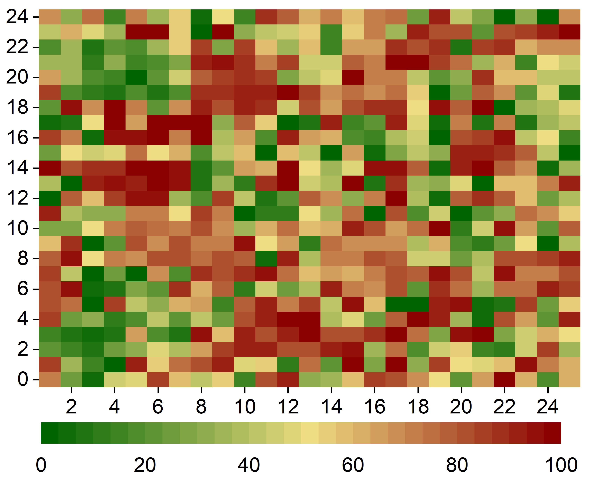
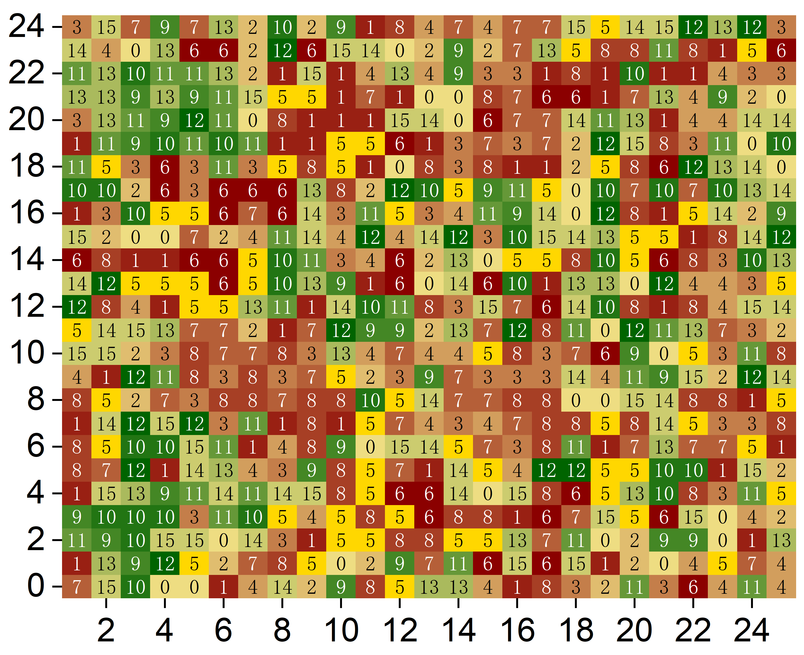

# HEEUP_rebuttal-Reviewer-5

##  Q1 Supplement：HEEUP vs [1，2]
| Difference   | HEEUP                                        | [1]                                      | [2] | Remarks                                     |
|--------------|----------------------------------------------|------------------------------------------|-----------------------------|---------------------------------------------|
| Objective    | Minimize energy consumption for efficient urban layout | Adapt to complex terrain, optimize urban community spatial planning | Focus on road planning, emphasizing accessibility, connectivity, and travel distance | HEEUP focuses on energy efficiency, [1] on terrain adaptability, [2] on road planning |
| Strategy     | Hierarchical decision-making: from macro to micro optimization | Sequential decision-making: dynamic adaptation, continuous planning | Two-stage shielding strategy optimization to achieve universal connection quickly and increase roads to reduce travel distance within slums | HEEUP uses hierarchical vs. [1] sequential decision-making process, [2] stages for universal connection |
| State        | Comprehensive urban feature encoding (GAT+GAE), capturing full-spectrum multi-dimensional information | Progress and data encoding (GNN+Encoder), reflecting real-time planning dynamics | GNN state encoder | GAT in HEEUP enhances feature interrelation vs. GNN in [1] focuses on progress and statistics, [2] uses GNN for state encoding |
| Action       | Multi-dimensional actions, adjusting various aspects of urban planning from macro to micro | Focused on single decision-making for land use and roads | Road planning | HEEUP allows multi-level refinement vs. [1] single-point decision-making, [2] focuses solely on road planning |
| Reward       | Energy efficiency as the core metric at each hierarchical level | Service quality, ecological balance, and traffic flow efficiency make up a composite reward system | Two-stage connectivity priority reward system | Tiered focus on energy in HEEUP vs. diverse urban benefits in [1], [2].|

## Figure 5(b) Supplement
We have additionally added the urban function type corresponding to 25*25. Each urban function type has a corresponding standard energy consumption. By comparison, it can be found that the energy consumption of buildings within the grid area is consistent with the energy consumption of urban structures. This proves that the HEEUP planning strategy is based on reasonable layout.

The goal of HEEUP is not just to reduce energy consumption, but to ensure the rationality of urban structures → land use configuration → building design. This approach emphasizes the importance of overall planning while also taking into account the need for energy conservation.

## Displays the relative energy intensity of all buildings in each of the 25*25 grids.

## Displays the LCZ category corresponding to the relative energy intensity of all buildings in each of the 25*25 grids.

### Building Type Energy Consumption

| Code | Energy Usage (kWh) | | Code | Energy Usage (kWh) |
|------|--------------------|-|------|--------------------|
| 0    | 4,439.06           | | 8    | 3,307.50           |
| 1    | 5,186.65           | | 9    | 5,643.98           |
| 2    | 65,149.95          | | 10   | 21,095.52          |
| 3    | 14,070.69          | | 11   | 9,477.88           |
| 4    | 9,170.01           | | 12   | 24,177.49          |
| 5    | 984.60             | | 13   | 54,797.58          |
| 6    | 3,981.91           | | 14   | 96,722.39          |
| 7    | 5,192.43           | | 15   | 135,819.14         |

### Local Climate Zone Energy Consumption

| LCZ  | Energy Consumption (kWh) | | LCZ  | Energy Consumption (kWh) |
|------|---------------------------|-|------|---------------------------|
| 0    | 1,701,204.86              | | 8    | 2,275,585.12              |
| 1    | 2,279,408.75              | | 9    | 34,655.61                 |
| 2    | 1,740,707.20              | | 10   | 12,466.32                 |
| 3    | 1,905,982.95              | | 11   | 236,784                   |
| 4    | 1,775,184.72              | | 12   | 12,323.35                 |
| 5    | 3,423,751.57              | | 13   | 623,545.11                |
| 6    | 5,326,511.59              | | 14   | 933,454.423               |
| 7    | 2,059,901.91              | | 15   | 246,323.32                |

### Local Climate Zone (LCZ)

| Code | Building Themes        | Code | Building Themes             |
|------|------------------------|------|-----------------------------|
| 0    | Compact high-rise      | 8    | Heavy industry              |
| 1    | Compact midrise        | 9    | Dense trees                 |
| 2    | Compact low-rise       | 10   | Scattered trees             |
| 3    | Open high-rise         | 11   | Bush, scrub                 |
| 4    | Open midrise           | 12   | Low plants                  |
| 5    | Open low-rise          | 13   | Bare rock or paved          |
| 6    | Large low-rise         | 14   | Sparsely built              |
| 7    | Lightweight low-rise   | 15   | Water                       |
